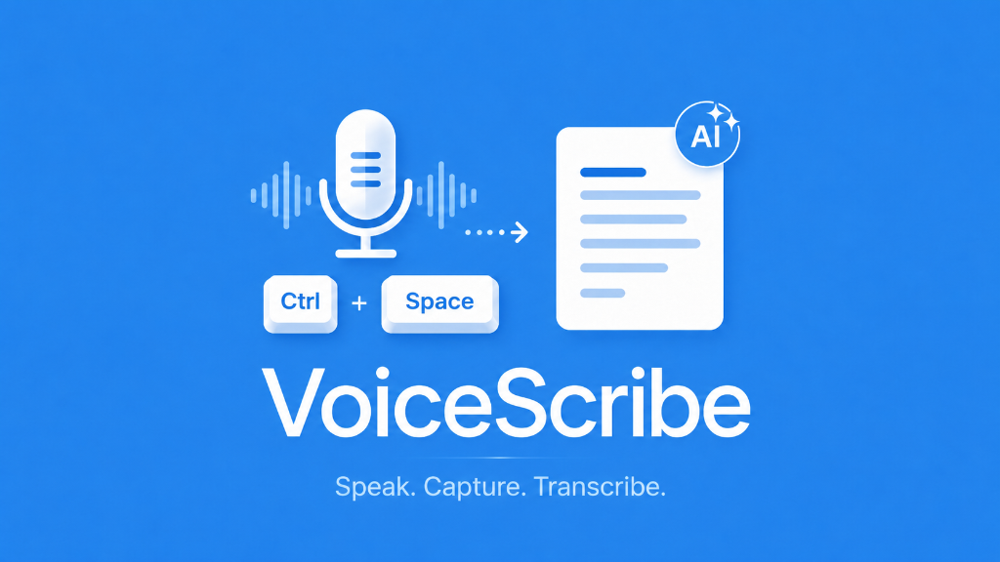

# 🎙️ VoiceScribe — Windows 11 Akıllı Sesli Dikte (Voice-to-Text)

[](https://github.com/onderxyilmaz/voice-scribe/releases)
[-10B981?style=for-the-badge&logo=windows)](https://github.com/onderxyilmaz/voice-scribe/releases/download/v1.0.0/VoiceScribe.Setup.1.0.0.exe)
[-6366F1?style=for-the-badge&logo=windows)](https://github.com/onderxyilmaz/voice-scribe/releases/download/v1.0.0/VoiceScribe.1.0.0.exe)



---

## 📥 Hemen İndirin ve Kullanın (Downloads)

Kod derlemenize veya depoyu indirmenize gerek kalmadan **VoiceScribe** uygulamasını doğrudan bilgisayarınızda kullanabilirsiniz:

| Sürüm Türü | Açıklama | Doğrudan İndirme Bağlantısı |
| :--- | :--- | :--- |
| 🟢 **Windows Kurulum (Setup)** | Masaüstüne ve Başlat menüsüne kısayol ekleyen kurulum dosyası. | [📥 **VoiceScribe Setup 1.0.0.exe (İndir)**](https://github.com/onderxyilmaz/voice-scribe/releases/download/v1.0.0/VoiceScribe.Setup.1.0.0.exe) |
| 🟣 **Taşınabilir (Portable)** | Kuruluma gerek duymadan doğrudan çalıştırılabilen tek dosya sürümü. | [📥 **VoiceScribe 1.0.0.exe (Portable İndir)**](https://github.com/onderxyilmaz/voice-scribe/releases/download/v1.0.0/VoiceScribe.1.0.0.exe) |

> 📌 *Tüm yayınlanan güncel ve geçmiş sürümlere [GitHub Releases Sayfası](https://github.com/onderxyilmaz/voice-scribe/releases) üzerinden de ulaşabilirsiniz.*

---

## 🌟 Öne Çıkan Özellikler

- 🚀 **Tam Yerel ve Çevrimdışı Dikte (Local Whisper):** İnternet bağlantısı olmadan `faster-whisper` altyapısı ile %100 gizli ve yerel Türkçe/İngilizce dikte yapabilme.
- ⚡ **Bulut API Desteği (Hybrid Engine):** Groq Cloud (`whisper-large-v3-turbo`), OpenAI Whisper, OpenRouter ve Deepgram altyapılarını tek tıkla kullanabilme.
- 🤖 **Yapay Zeka Metin Temizleme (AI Cleanup):** Dikte ettiğiniz konuşmalardaki duraksamaları (*"ııı, şey"*), tekrarları ve noktalama hatalarını Gemini / Claude / GPT modelleriyle otomatik düzeltme.
- ⌨️ **Global Kısayol Tuşu (Ctrl + Space):** Hangi uygulamada (VS Code, Notepad, Chrome, Word vb.) olursanız olun kısayola bastığınızda sesinizi kaydeder ve metni **otomatik olarak aktif imleç konumuna yazar**.
- 🎛️ **Görsel Temalar:** **Dark Obsidian** (Derin Siyah & Indigo) ve **Midnight Lavender** (Color Hunt Lacivert & Gece Lavantası) temaları.
- 🎨 **60 FPS HUD Kapsülü:** Kayıt esnasında ekranın altında beliren, sesinizin ritmine göre şekil alan canlı ses dalgası görselleştiricisi.
- 📖 **Özel Fonetik Sözlük:** Kurumsal veya teknik terimleri (Örn: *VS Code*, *React*, *TypeScript*) kendi okunuşlarına göre otomatik düzelten özel sözlük.

---

## 🛠️ Teknolojiler & Mimarisi

- **Frontend:** React 19, Vite, Vanilla CSS Glassmorphism
- **Masaüstü Katmanı:** Electron 34, Win32 P/Invoke Keystroke Injection (`keybd_event`)
- **Yerel STT:** Python `faster-whisper` (UTF-8 stdout stream)
- **Paketleme:** `electron-builder`, NSIS Installer

---

## 💻 Geliştirici Modunda Çalıştırma

### 1. Depoyu Klonlayın
```bash
git clone https://github.com/onderxyilmaz/voice-scribe.git
cd voice-scribe
```

### 2. Bağımlılıkları Yükleyin
```bash
npm install
```

### 3. Geliştirici Modunda Çalıştırın
```bash
npm run electron:dev
```

### 4. Kurulum Dosyalarını (.exe) Derleyin
```bash
npm run dist:win
```

---

## 📄 Lisans

Bu proje **MIT** lisansı ile lisanslanmıştır. Geliştirici: **Önder Yılmaz**.
